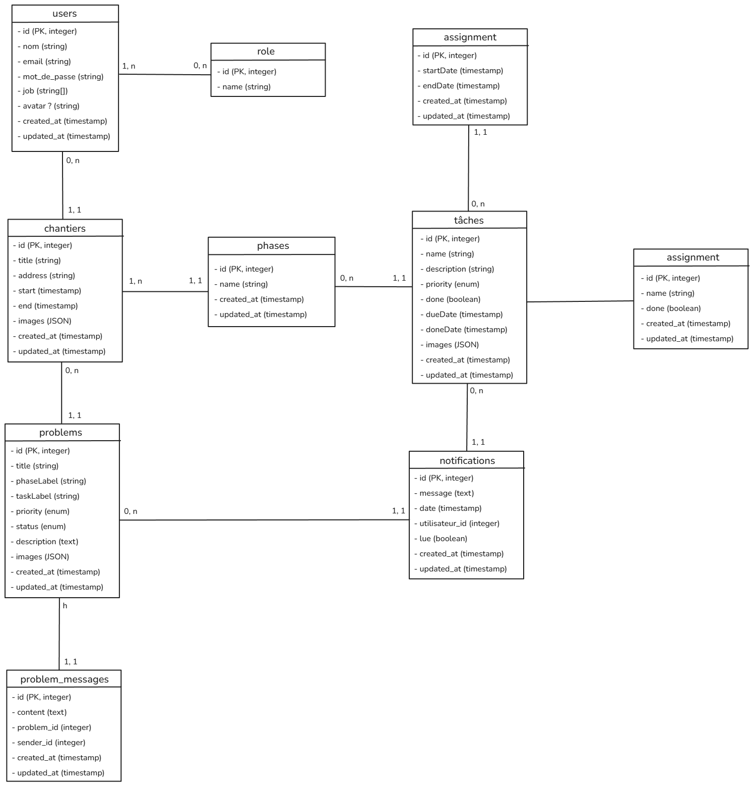

# 📌 Gestion des Chantiers – Application Web & Mobile

## 🏗️ Description  
Cette application vise à **optimiser la gestion des chantiers** en facilitant :  
- ✅ La **communication** entre les parties prenantes (chefs de chantier, artisans, clients).  
- ✅ Le **suivi en temps réel** des tâches et des phases du projet.  
- ✅ La **gestion des ressources** (documents, photos, équipes).  
- ✅ Le **reporting et la notification** des événements critiques.  

## 🚀 Fonctionnalités Clés
- 📊 **Tableau de bord interactif** pour suivre l’avancement des chantiers
- 🔄 **Gestion des phases et missions** avec statuts et validation des tâches via images
- 👥 **Rôles et permissions** : Administrateur, Chef de chantier, Artisan, Client
- 🔔 **Notifications intelligentes** pour le suivi des tâches et phases bloquantes
- 📂 **Stockage sécurisé** des documents et photos liés au chantier
- 🌐 **Application multi-plateforme** (Web et Mobile)

## 🛠️ Stack Technologique
- **Frontend** : Angular + Ionic (adaptabilité, rapidité, simplicité)
- **Backend** : Express (scalabilité, sécurité, API REST)
- **Base de données** : PostgreSQL (cohérence des données, relations structurées)
- **Infrastructure** : Docker, hébergement Cloud (AWS/Azure)
- **Authentification** : JWT (JSON Web Token)

## 🎯 Objectifs  
- Remplacer les outils traditionnels (Excel, WhatsApp, papier).  
- Permettre un **suivi précis des chantiers** et une meilleure coordination des équipes.  
- Garantir la **sécurité et la conformité** des données.

## 🏛️ Modèle relationelle des données


## 📌 Installation & Déploiement  

### 🔧 Prérequis  
- ```Node.js``` ≥ 20.x  
- ```PostgreSQL```  
- ```Docker``` et ```Docker Compose``` (optionnel)  

### 🔨 Mise en place locale  
1. **Cloner le dépôt**  
   ```git clone https://github.com/votre-organisation/gestion-chantiers.git```  
   ```cd gestion-chantiers```  
2. **Copier et configurer l’environnement**  
   ```cp .env.example .env```  
   puis modifier les variables dans ```.env``` (```DB_HOST```, ```DB_PORT```, ```DB_USER```, ```DB_PASSWORD```, ```DB_NAME```, ```JWT_SECRET```, ```PORT```, …)  
3. **Installer les dépendances**  
   - Frontend :  
     ```cd Frontend/easy-planner```  
     ```npm i```  
   - Backend :  
     ```cd Backend```  
     ```npm i```  
4. **Lancer en mode développement**  
   - Frontend :  
     ```cd Frontend/easy-planner```  
     ```npm run dev```  
   - Backend :  
     ```cd Backend```  
     ```npm run dev```  
5. **Charger des données factices** (optionnel)  
   ```node Backend/loadFakeData.js```  

### 🐳 Avec Docker  
- ```docker-compose up --build -d```

Et voilà vous pouvez maintenant visiter localhost:4200 pour voir la partie frontend !

## 📋 Utilisateurs de Test

Pour vos essais, vous pouvez vous connecter avec l'une des adresses suivantes qui représentent chacun des rôles, en utilisant **Azerty123** comme mot de passe commun :
- admin@gmail.com
- moderator@gmail.com
- artisan@gmail.com
- client@gmail.comjs

## ✅ Tests

### 📦 Technologies de test utilisées
- Jest pour les tests unitaires
- Supertest pour les tests HTTP (si applicable)

### 📁 Structure des tests
Les tests unitaires sont situés dans le dossier :
__tests__/controllers/

### 🚀 Exécution des tests
1. Accède au dossier du backend :
   ```cd Backend```

2. Lance tous les tests :
   ```npm run test```

3. Ou exécute un test spécifique :
   ```npx jest __tests__/controllers/user.controller.test.js```

### 🧪 Bonnes pratiques
- Chaque contrôleur a son propre fichier de test.
- Les dépendances (modèles Sequelize, bcrypt, etc.) sont **mockées**.
- Les tests couvrent les cas de succès ✅ et d’échec ❌ (ex. : DB non disponible, utilisateur introuvable, etc.).
- Le retour JSON et les codes HTTP (200, 201, 400, 404, 500) sont systématiquement vérifiés.

### 📊 Objectif de couverture
La couverture minimale est définie dans le fichier package.json :

```json
"coverageThreshold": {
  "global": {
    "branches": 70,
    "functions": 70,
    "lines": 70,
    "statements": 70
  }
}
```

## 🔄 Intégration Continue & Déploiement (CI/CD)  
La pipeline GitHub Actions se trouve dans le fichier ```.github/workflows/ci.yml```. Elle se déclenche sur chaque push ou pull_request vers la branche ```main``` et comporte trois jobs : 
- frontend-ci
- backend-ci
- deploy.  

